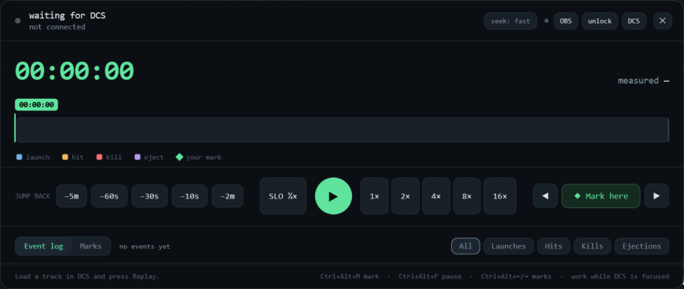

# DCS Replay Deck

**Rewind a DCS track — and turn any moment into a video clip.** Every launch, hit, kill and
ejection colour-coded on a timeline, marks you can name and jump straight back to, and
one-button recording straight to OBS.

Built for making video. Miss the shot? Jump back. Want that AMRAAM launch captured from the
run-up? Mark it, hit record, and come back to a clip on disk.

<!-- Path is ReplayDeck.png, NOT deck/ReplayDeck.png. This file is copied to the PUBLIC repo,
     where the screenshot sits at the root; only the source repo has it under deck/. -->

*Interface designed by **johnkappa**.*

---

## Install

1. Download **ReplayDeck.exe**
2. Run it
3. **Restart DCS**

That's it. The exe installs its own DCS hook the first time you run it, and repairs it
automatically whenever you update. Nothing to copy, nothing to unzip.

Nothing is written into your DCS install folder — the hook lives in
`Saved Games\DCS\Scripts\Hooks\`, so it survives DCS updates and cannot break an integrity
check.

## What it does

- **Rewind** — jump back 10s / 30s / 60s / 5m, or a custom amount, from wherever you are
- **Marks** — pause, name a moment, and jump straight back to it any time. Lands early so you
  catch the run-up
- **Record to video** — connect OBS once, then record any mark (or *every* mark, unattended)
  straight to a clip. It seeks, captures the run-up and the moment, and stops on its own
- **Events on a timeline** — every launch, hit, kill and ejection from DCS's own data,
  colour-coded and filterable, and every one seeks you there. No Tacview needed
- **Global hotkeys** — mark, pause and jump between marks without alt-tabbing out of DCS
- **Unlock restricted tracks** — one click makes a watchable copy of a view-locked
  multiplayer track. Your original is never touched
- **Slow motion** — down to 1/4× for missile impacts

## About rewind

**DCS cannot actually rewind, and it never has.** A `.trk` file is the mission, plus a
recording of every command you pressed, plus a random seed — DCS re-simulates the whole thing
from the start each time you play it. There is no saved snapshot of minute 47 to jump back to.

So Replay Deck rewinds the only way anything can: it restarts the track and fast-forwards back
to where you asked for, then pauses on the exact second. **One button instead of a menu
crawl**, and you can walk away while it works.

Short tracks are near enough instant. An hour into a busy multiplayer track takes a few
minutes — the deck tells you how long while it runs.

## Where the event markers come from

DCS's own debriefing data, not Tacview. No export step, no extra software, and it works on
tracks you flew months ago. Events appear **after a replay pass finishes**, because that is
when DCS writes them — run a track through once, or seek to the end, and every event is on the
timeline from then on. Saved per mission, so it is a one-time cost per track.

## Recording with OBS

In OBS: **Tools → WebSocket Server Settings → Enable**, then **Show Connect Info** for the
password. In the deck, click **OBS**, paste it, connect. The password is stored encrypted on
your own machine and never leaves it. Then the ● on any mark records it to a clip.

## Requirements

- Windows
- DCS World
- OBS Studio (only if you want the recording feature)
- Nothing else. The exe is self-contained; no .NET install needed.

## Support and bug reports

**Support and bug reports go through Discord, not GitHub issues.**

**https://discord.gg/PGfmpJMeY5**

That is where problems actually get solved. Nearly every report needs a follow-up question —
which track, which DCS folder, what the log says — and that is two minutes in Discord and a
fortnight in an issue tracker. It is also where new builds land first, so it is the place to
be if you want fixes before everyone else.

Bugs, ideas and "it did something weird" are all welcome.

---

## Licence

Free to use, but not open source. You may **not** redistribute the file, repackage it, sell
it, or reverse-engineer it — share the Discord link instead. Full terms in
[LICENSE.txt](LICENSE.txt).

It is an independent tool and is **not affiliated with Eagle Dynamics**. It drives DCS for you
and comes with no warranty; you use it at your own risk.

---

*Copyright © SYNTAX. All rights reserved.*
